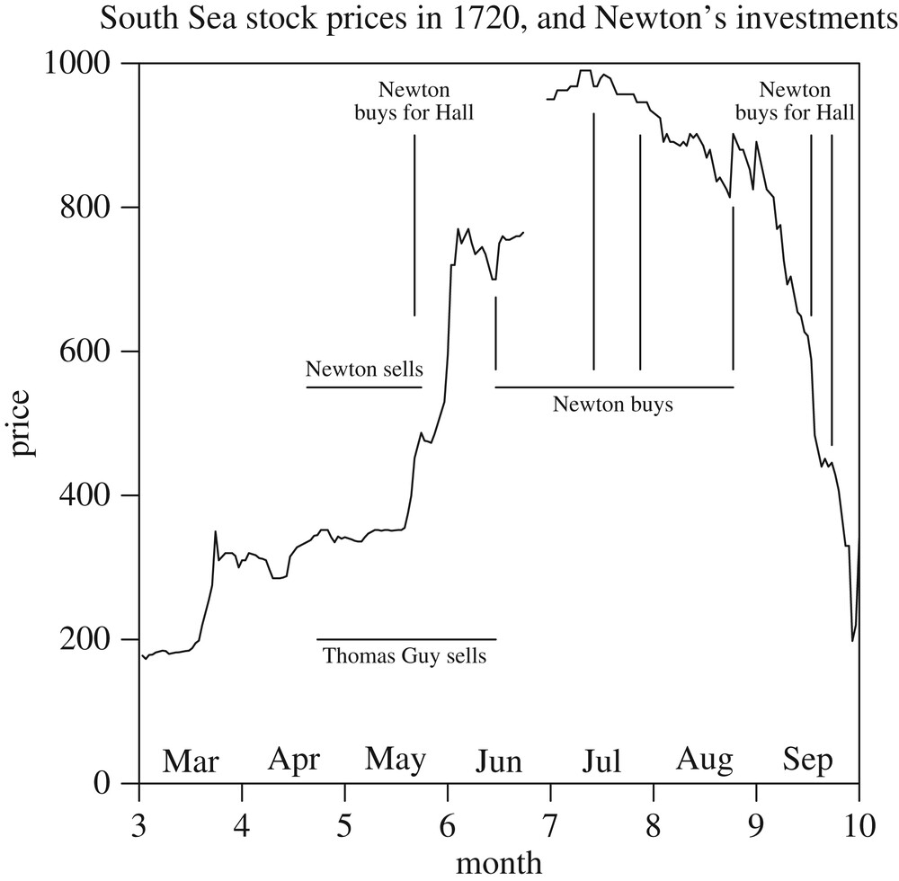

# Newton's Bizarre (Financial) Adventure

Last Edited: 2025-06-09

> "Bloody Hell, I've lost all my money!"
> 
> Isaac Newton, mungkin, waktu melihat investasinya di South Sea Company anjlok

# Latar Belakang
Yang namanya serakah, melihat ada peluang untuk mendapatkan uang banyak dalam waktu yang singkat, memang tidak memandang tingkat pendidikan seseorang atau kekayaan seseorang. Bahkan salah satu orang paling pintar sepanjang sejarah saja seperti Sir Isaac Newton bisa menjadi korban godaan keserakahan.

Newton kurang pintar apa, kontribusinya di bidang ilmu pengetahuan bukan cuma di persamaan gravitasi yang kita pelajari di kelas fisika SMA, namun juga di bidang kalkulus, optika, dan kimia. Beliau juga bukan orang kere yang butuh uang untuk cicilan rumah. Posisinya pada waktu ini terjadi adalah sebagai Master of Royal Mint, lembaga yang bertanggung jawab untuk mencetak uang di Inggris, mungkin di sini setara Dirjen Peruri. Namun terlepas dari kecerdasannya yang luar biasa tersebut, rayuan cuan instan tetap bisa membuat Newton menjadi korban.

# Metodologi dan Analisis

Di Inggris awal abad ke 18, setidaknya ada 3 emiten yang populer di BEI (Bursa Efek Inggris): Bank of England (BoE), East India Company (EIC), dan South Sea Company (SSC).

BoE ini fungsinya seperti Bank Indonesia sekarang, yaitu sebagai bank sentral, menjaga stabilitas ekonomi. EIC memonopoli perdagangan rempah2 di Asia, berkompetisi dengan VOC. SSC, fokus dari tulisan ini, bergerak di bidang perdagangan budak manusia untuk Amerika Latin.

Konon kisahnya, Newton mulai akum saham SSC dari tahun 1717, dengan average price di bawah 100 pound sebanyak kurang lebih 10,000 lembar.

Pada bulan Mei 1720, di awal dari bubble, Newton sudah TP sebanyak 8000 lembar di harga 350. Jadi sebenarnya Newton sudah cuan bagger dengan realized gain sebesar 20,000 pound. Ini tentu nilainya di tahun itu lebih besar dari gaji Anthony seminggu di MU.

Bayangkan kalau dulu sudah ada forum saham zaman dulu, mungkin dia bakal post seperti ini

*kalau mau info A1 saham calon multibagger lainnya, bisa join group telegram (beneran) saya, cukup 69 pound untuk seumur hidup. link di bio. #conviction #financialfreedom*

Namun entah mengapa, mungkin dapat bisikan info yang katanya A1 kalau bandar asing BatuHitam mau masuk, Newton beli lagi sahamnya mulai dari bulan Juni 1720, ketika harganya sudah naik ke 700 pound sebanyak kurang lebih 4000 lembar. Sehingga Newton total memegang 6,000 lembar saham dengan average price 500 pound.

Tapi sayangnya itu ternyata hanya jebakan bandar belaka, yang ingin ritel cut loss. Isu aslinya lebih karena walaupun dapat monopoli perdagangan budak, Amerika Selatan sudah duluan dikuassi oleh Spanyol di Argentina dan Chile, serta Portugal di Brazil. Jadi sudah saturated marketnya dan tidak bisa bersaing.

Harganya turun terus sejak sampai di puncaknya di bulan Juli sebesar 1000 pound, dan di tahun 1721, harga SSC sudah kembali di bawah 100 pound, sehingga Newton resmi jadi nyangkuter bersama ritel2 lainnya, dengan unrealized loss kira-kira 24,000 pound, lebih tinggi dari realied profit awalnya. Newton meninggal di tahun 1727, dan tidak mempunyai anak, sehingga saham nyangkutnya tidak diwariskan ke keturunannya.

Kalau ingin tahu lebih detail bagaimana kronologi, disertai testimoni dari orang2 yang berperan di masa itu, bisa dibaca lebih lanjut di paper berikut: https://royalsocietypublishing.org/doi/10.1098/rsnr.2018.0018

# Penutup dan Kesimpulan
Tentunya south sea bubble ini bukanlah yang pertama terjadi, dan tidak akan menjadi yang terakhir. Sebelumnya ada Tulip Mania, dan di era modern ada dot-com bubble, hingga yang terbaru seperti NFT.

Bagaimana dengan di Indonesia? Masih ingat dengan batu akik? Atau kalau spesifik di bursa saham ada Bank Digital di tahun 2020.

*dan terjadi lagi, kisah lama yang terulang kembali*

Pesan moral yang bisa kita tarik tentunya adalah serakah itu tidak baik. Hindarilah saham2 gorengan, karena kadar kolesterolnya (risiko) yang tinggi, bahkan walaupun dimasak dengan extra virgin olive oil (bisikan surga dari influencer)

Membeli saham gorengan itu hanya ada 2 kemungkinan:
1. **Rugi**: Uang hilang 100 persen karena aset ini tidak punya fundamental, sehingga langsung jatuh ke 0 begitu sentimen berubah.

2. **Untung, tapi tidak berkah**: Walaupun kita hoki dan dapat untung, keuntungan yang kita dapatkan itu berasal dari kerugian orang lain, yg bisa jadi tidak mengerti apa yang dia beli, terpaku pada hype, dan akhirnya kehilangan semua tabungannya.

Kalau misalkan Anda tertarik dengan investasi yang berkelanjutan, pertimbangkan saham-saham yang berfokus pada dividen. Kunjungi halaman [Stock Screener](/screener) untuk mendapatkan daftar lengkapnya.

Selamat berinvestasi dengan bijak!
